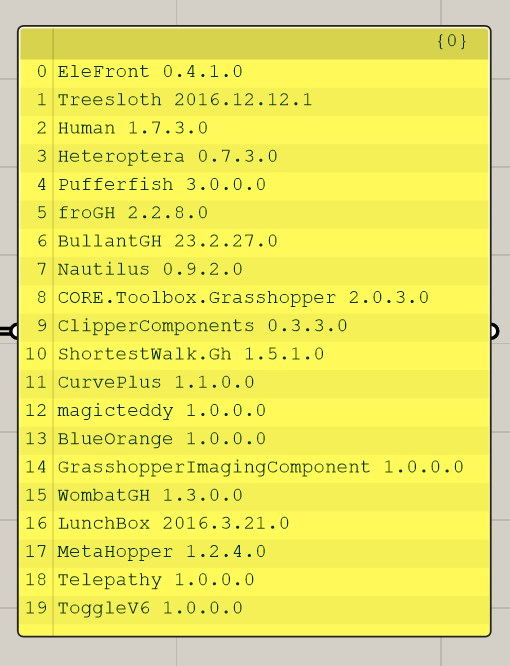

#  
 🦗 Sudden CNC Post 🦗 
  
###  
3-Axis Milling CNC Postprocessor in Grasshopper3D
###  Rhinoceros curves to G-Code
  
###  
*Profiles, pockets, engravings, re-machining, drilling operations. I use it mostly for furniture facade millings and drillings*

 

*Testing trajectories in [NC Corrector](http://www.nc-corrector.inf.ua/index_EN.htm)☢️
 

> **⚠️Warning** 
> This is a work-in-progress and not the finished product. 
> 
> Feel free to leave suggestions or report bugs in 
> the [issues](https://github.com/SahaSG552/GH-Sudden-CNC-Post/issues) section. 

# Demo

 

First of all you need to choose cutting material from database, or from referenced geometry and set LCS (Local Coordinate System). In this demo i chose 19mm MDF, rectangled shape from curve. 
You can select multiple pieces of material and place them wherever you need, machining will be carried out relative to the established initial coordinate system. 
Then you need to create geometry in specially named layer. Operation will be performed according layer name. There are some layer naming rules, but i didn't implement documentation yet 😏 Hope it will be soon 
In this example layer named `D10_19MM_SN` means that cutting instrument would be `D10` (cylinder 10mm diameter bit), cutting depth will be `19MM` and `SN` means that bit will be cutting outside profile.
You can combine curves and nest them within each other.

# Operations
- General 
    Inclined plunge cutting (engage in material under the certain angle) 
    Conventional/climb/mixed cutting direction 
    Optional nested geometry detection (geometry in geometry) 
    Circular interpolation (G2/G3 codes) 
    Different types of sorting including sorting by selection 

- Profile machining operation 
    Inside, outside, along profile 

- Pocketing operation 
    Effective cleaning of leftovers 

- Re-Machining 
    Cleaning corners after pocketing operation using smaller diameter bit 

- V-Carving operation 
    Corner sharpening movement using cone bit 

- Drilling operation 

## Example project

 
In this project using several instruments, each instrument could do several operations (one layer - one operation)

## Testing in NC Corrector
 

 

## Worklist image generator
 

 

This image is needed for the machine operator to give them a task. The image shows the geometry for processing, a list and order of the required operations, and automatically calculated processing time for each operation.

## 3rd Party Plugins Used
 

|

 

## In progress...
